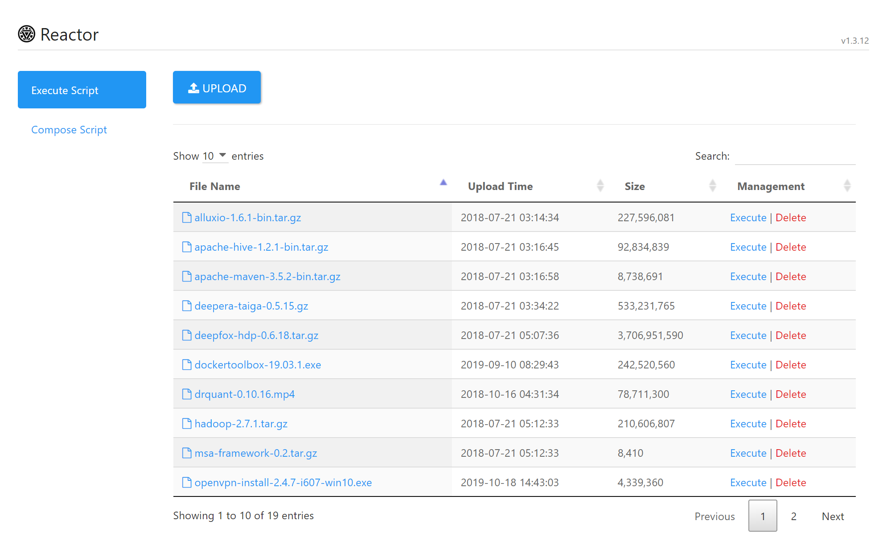
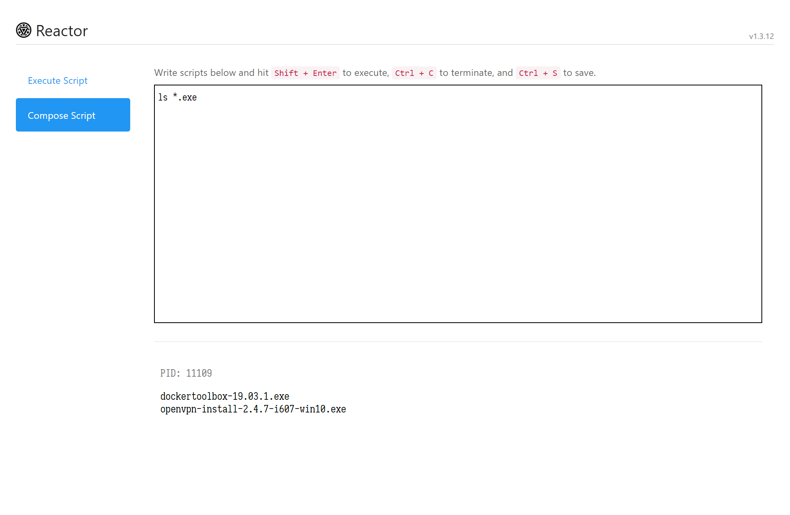

Reactor is a file management system which executes shell scripts. You could upload any files including shell scripts and execute them remotely from your browser.





For example, if you wish to download a file remotely when it is not possible to access in your current envionment (e.g., behind GFW), you could type and execute the following commands:

```
wget http://example.com/test.txt
```

Then the file will appear in the file list for download.

You can also use Reactor as a file host to upload and download files.

# Installation
Reactor requires PHP to deploy. Simply put the source files under your favorite web host, e.g., <a target='_blank' href='https://www.nginx.com/'>NGINX</a>, and you are ready to go.

# Authentication
Since shell scripts are dangerous, to prevent unsafe access, you must log in before any further operations. The authenication system is based on dynamic passwords, and you should use an authenticator, e.g., <a target='_blank' href='https://support.google.com/accounts/answer/1066447'>Google Authenticator</a> or <a target='_blank' href='https://docs.microsoft.com/en-us/azure/multi-factor-authentication/end-user/microsoft-authenticator-app-how-to'>Microsoft Authenticator</a>, to generate the passwords.

The default dynamic seed is `SMARTCUBEDEEPERA`.

In order to set up the authenticator, you should generate a QR code from the dynamic seed, e.g., use <a target='_blank' href='https://www.the-qrcode-generator.com/'>QR Code Generator</a> with the following text:

```
otpauth://totp/Reactor?secret=SMARTCUBEDEEPERA
```

Then use your authenticator to scan the QR code and get dynamic passwords.

To change the default dynamic seed, you could edit line `82` of `php/auth.php`.

---

&copy; 2017-2020 Valency